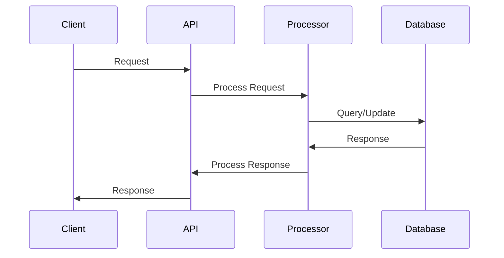
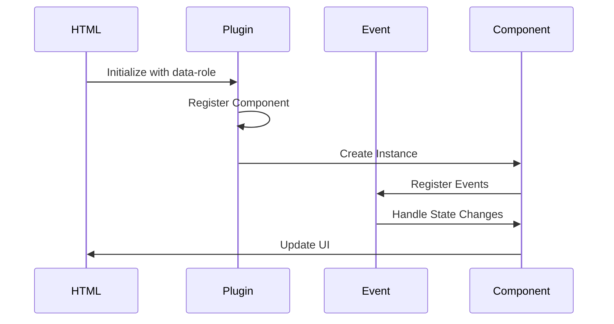

# Project Background Knowledge

This document consolidates all the documentation for the project, serving as a comprehensive reference for the system architecture, client implementation, and event handling.

## Table of Contents

1. [Server Architecture](#server-architecture)
2. [Client Architecture](#client-architecture)
3. [Event Handling System](#event-handling-system)
4. [State Validation System](#state-validation-system)

## Server Architecture

### System Description

The server-side system is designed to handle data processing, API endpoints, and business logic. It follows a modular architecture that separates concerns and promotes maintainability.

### Key Components

- **API Endpoints**: RESTful endpoints for data operations
- **Data Processing**: Business logic and data transformation
- **Authentication**: User authentication and authorization
- **Database**: Data persistence and retrieval

### System Workflow



### Model Design

The server implements a layered architecture:

1. **Controller Layer**
   - Request handling
   - Input validation
   - Response formatting

2. **Service Layer**
   - Business logic
   - Data processing
   - External service integration

3. **Data Layer**
   - Database operations
   - Data persistence
   - Query optimization

## Client Architecture

### System Description

The client-side system is built on an extensible HTML-based architecture where custom UI/UX components are implemented through custom attributes. The system follows a plugin-based architecture that allows for easy extension and maintenance of interactive components.

### Key Components

- **Entry Point**: `client/js/index.js`
- **Core Systems**:
  - Plugin System (`client/js/core/plugin.js`)
  - Event System (`client/js/core/event.js`)
  - Page Management (`client/js/core/page.js`)
- **Component Structure**:
  - JavaScript: Event handling and state management
  - SCSS: UI state definitions
  - HTML: Component markup with custom attributes

### System Workflow



### Plugin System

The client implements a plugin-based architecture with the following features:

1. **Plugin Structure**
   ```javascript
   {
     name: String,
     defaultOpt: Object,
     init: Function,
     load: Function,
     render: Function,
     destroy: Function
   }
   ```

2. **Standard Plugin Events**
   - Initialization Events
   - Loading Events
   - Rendering Events
   - Destruction Events

3. **Plugin Lifecycle**
   - Initialization
   - Loading
   - Rendering
   - Destruction

## Event Handling System

### Overview

The client implements a robust event handling system through the `event.js` module, which provides a flexible and powerful way to manage events throughout the application. The system supports both custom events and DOM events, with namespace support for better event organization.

### Core Event Functions

1. **Event Registration (`on`)**
   ```javascript
   on(eventName, callback, options)
   ```
   - Registers event listeners for custom events or DOM events
   - Supports space-separated multiple events
   - Supports namespaced events
   - Options parameter for DOM events

2. **One-time Event Registration (`once`)**
   ```javascript
   once(eventName, callback)
   ```
   - Registers an event listener that will be automatically removed after first execution

3. **Event Removal (`off`)**
   ```javascript
   off(eventName)
   ```
   - Removes event listeners for specified events
   - Supports space-separated multiple events

4. **Event Emission (`emit`)**
   ```javascript
   emit(eventName, data)
   ```
   - Triggers custom events with optional data
   - Supports space-separated multiple events

5. **Event Trigger (`trigger`)**
   ```javascript
   trigger(name, ...params)
   ```
   - Versatile function that can:
     - Call a function directly
     - Call a global function by name
     - Emit a custom event

### Data Attribute Integration

The event system can be triggered through HTML data attributes:

```html
<button data-trigger="user.login" data-params='{"id": 1, "name": "John"}'>
  Login
</button>
```

### Event Namespaces

The event system supports namespacing:
- Events can be namespaced using dot notation
- Default namespace is 'DEFAULT'
- Namespaces help prevent event name collisions

### Best Practices

1. **Event Naming**
   - Use descriptive, action-oriented names
   - Follow consistent naming patterns
   - Use namespaces for better organization

2. **Event Cleanup**
   - Always remove event listeners when components are destroyed
   - Use `off()` to clean up specific events
   - Consider using `once()` for one-time events

3. **Event Data**
   - Keep event data minimal and relevant
   - Use consistent data structures
   - Document expected event data formats

4. **Error Handling**
   - Implement error handling in event callbacks
   - Use try-catch blocks for critical operations
   - Log errors appropriately

### Performance Considerations

1. **Event Listener Management**
   - Remove unused event listeners
   - Use `once()` for one-time events
   - Implement proper cleanup in component destruction

2. **Event Data Size**
   - Keep event data payloads small
   - Avoid sending unnecessary data
   - Consider using references for large objects

3. **Event Frequency**
   - Throttle high-frequency events
   - Debounce rapid event sequences
   - Batch related events when possible

## Integration Points

### Server-Client Communication

1. **API Integration**
   - RESTful endpoints
   - WebSocket connections
   - Real-time updates

2. **Data Flow**
   - Request/Response cycle
   - Event-based updates
   - State synchronization

### Plugin-Event Integration

1. **Plugin Lifecycle Events**
   - Initialization events
   - Loading events
   - Rendering events
   - Destruction events

2. **Custom Plugin Events**
   - Component-specific events
   - Cross-component communication
   - State management events

## Development Guidelines

### Code Organization

1. **File Structure**
   - Clear separation of concerns
   - Modular component design
   - Consistent naming conventions

2. **Component Design**
   - Single responsibility principle
   - Reusable components
   - Clear interfaces

### Testing Strategy

1. **Unit Testing**
   - Component testing
   - Event handling testing
   - Plugin testing

2. **Integration Testing**
   - Server-client integration
   - Plugin interaction
   - Event flow testing

### Documentation Standards

1. **Code Documentation**
   - JSDoc comments
   - Type definitions
   - Usage examples

2. **API Documentation**
   - Endpoint descriptions
   - Request/Response formats
   - Error handling

## Maintenance and Support

### Debugging

1. **Event Debugging**
   - Event logging
   - Event tracing
   - Performance monitoring

2. **Error Handling**
   - Error logging
   - Error recovery
   - User feedback

### Performance Optimization

1. **Event Optimization**
   - Event debouncing
   - Event throttling
   - Event batching

2. **Resource Management**
   - Memory management
   - Event listener cleanup
   - Resource pooling 

## State Validation System

### Overview

The system implements a comprehensive state validation system using a centralized state dictionary instead of regex patterns. This approach provides better maintainability, accuracy, and extensibility for handling US state codes and names.

### State Dictionary

The state validation system is built around `helpers/stateDict.js`, which contains:

1. **Complete State Dictionary**
   - All 50 US states with their codes and full names
   - US territories (DC, AS, GU, MP, PR, VI)
   - Case-insensitive validation

2. **Helper Functions**
   - `isValidStateCode(stateCode)`: Validates state codes
   - `getStateFullName(stateCode)`: Gets full state name from code
   - `getStateCode(fullName)`: Gets state code from full name
   - `getAllStateCodes()`: Returns array of all state codes
   - `getAllStateFullNames()`: Returns array of all state full names

### Usage Examples

```javascript
import { isValidStateCode, getStateFullName, getStateCode } from './helpers/stateDict.js';

// Validate state codes
isValidStateCode('CA');     // true
isValidStateCode('ca');     // true (case-insensitive)
isValidStateCode('XX');     // false

// Get full state names
getStateFullName('CA');     // 'California'
getStateFullName('TX');     // 'Texas'

// Get state codes from full names
getStateCode('California'); // 'CA'
getStateCode('california'); // 'CA' (case-insensitive)
```

### Integration Points

1. **Geo Path Validation**
   - Used in `helpers/geo.js` for path parsing
   - Replaces regex pattern `/^[a-z]{2}$/i` with `isValidStateCode()`
   - Ensures only valid state codes are accepted

2. **API Validation**
   - Validates state parameters in API endpoints
   - Provides consistent error messages for invalid states
   - Supports both state codes and full names

### Benefits Over Regex Validation

1. **Accuracy**
   - Only accepts valid US state codes
   - Prevents false positives from invalid 2-letter codes
   - Includes all US territories

2. **Maintainability**
   - Centralized state definitions
   - Easy to update state information
   - Clear validation logic

3. **Extensibility**
   - Easy to add new validation functions
   - Support for both codes and full names
   - Future-proof for additional state-related features

### Migration from Regex

The system previously used regex pattern `/^[a-z]{2}$/i` for state validation. This has been replaced with the state dictionary approach for better accuracy and maintainability. 