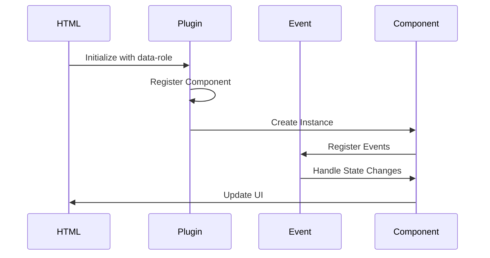

# Client Documentation

## System Description

The client-side system is built on an extensible HTML-based architecture where custom UI/UX components are implemented through custom attributes. The system follows a plugin-based architecture that allows for easy extension and maintenance of interactive components.

### Key Components

- **Entry Point**: `client/js/index.js`
- **Core Systems**:
  - Plugin System (`client/js/core/plugin.js`)
  - Event System (`client/js/core/event.js`)
  - Page Management (`client/js/core/page.js`)
- **Component Structure**:
  - JavaScript: Event handling and state management
  - SCSS: UI state definitions
  - HTML: Component markup with custom attributes

## Event Handling System

The client implements a robust event handling system through the `event.js` module, which provides a flexible and powerful way to manage events throughout the application. The system supports both custom events and DOM events, with namespace support for better event organization.

### Core Event Functions

1. **Event Registration (`on`)**
   ```javascript
   on(eventName, callback, options)
   ```
   - Registers event listeners for custom events or DOM events
   - Supports space-separated multiple events
   - Supports namespaced events (e.g., 'event.namespace')
   - Options parameter for DOM events (e.g., { once: true })

2. **One-time Event Registration (`once`)**
   ```javascript
   once(eventName, callback)
   ```
   - Registers an event listener that will be automatically removed after first execution
   - Wrapper around `on` with `{ once: true }` option

3. **Event Removal (`off`)**
   ```javascript
   off(eventName)
   ```
   - Removes event listeners for specified events
   - Supports space-separated multiple events
   - Handles both custom events and DOM events

4. **Event Emission (`emit`)**
   ```javascript
   emit(eventName, data)
   ```
   - Triggers custom events with optional data
   - Supports space-separated multiple events
   - Data can be a single value or an array of values

5. **Event Trigger (`trigger`)**
   ```javascript
   trigger(name, ...params)
   ```
   - Versatile function that can:
     - Call a function directly
     - Call a global function by name
     - Emit a custom event

### Event Namespaces

The event system supports namespacing to better organize and manage events:
- Events can be namespaced using dot notation (e.g., 'user.login', 'data.update')
- Default namespace is 'DEFAULT' if not specified
- Namespaces help prevent event name collisions
- Allows for more granular event handling and cleanup

### Usage Examples

1. **Basic Event Handling**
   ```javascript
   // Register event listener
   on('user.login', (userData) => {
     console.log('User logged in:', userData);
   });

   // Emit event
   emit('user.login', { id: 1, name: 'John' });
   ```

2. **Multiple Events**
   ```javascript
   // Register multiple events
   on('data.update data.delete', (data) => {
     console.log('Data changed:', data);
   });

   // Emit multiple events
   emit('data.update data.delete', { id: 1 });
   ```

3. **One-time Events**
   ```javascript
   // Register one-time event
   once('initial.load', () => {
     console.log('Initial load complete');
   });
   ```

4. **Namespaced Events**
   ```javascript
   // Register namespaced event
   on('user.profile.update', (profile) => {
     console.log('Profile updated:', profile);
   });

   // Remove specific namespaced event
   off('user.profile.update');
   ```

### Event System Integration

The event system is integrated with various parts of the application:

1. **Plugin System**
   - Plugins can emit and listen to events
   - Events are used for plugin lifecycle management
   - Cross-plugin communication through events

2. **Page Management**
   - Page transitions and lifecycle events
   - Component state changes
   - User interaction events

3. **Data Management**
   - Data update notifications
   - Cache invalidation events
   - State synchronization events

### Best Practices

1. **Event Naming**
   - Use descriptive, action-oriented names
   - Follow consistent naming patterns
   - Use namespaces for better organization

2. **Event Cleanup**
   - Always remove event listeners when components are destroyed
   - Use `off()` to clean up specific events
   - Consider using `once()` for one-time events

3. **Event Data**
   - Keep event data minimal and relevant
   - Use consistent data structures
   - Document expected event data formats

4. **Error Handling**
   - Implement error handling in event callbacks
   - Use try-catch blocks for critical operations
   - Log errors appropriately

## System Workflow



### Component Lifecycle

1. **Initialization**
   - HTML element with `data-role` attribute
   - Plugin registration
   - Component instance creation

2. **Event Handling**
   - Event registration
   - State management
   - UI updates

3. **Communication**
   - Event-based messaging
   - Component interaction
   - State synchronization

4. **Destruction**
   - Event cleanup
   - Resource release
   - Instance removal

## System Plugins Detail

### 1. Player Plugin
**File**: `client/js/plugins/_player.js`
**Usage**:
```html
<div class="player" 
     data-role="player" 
     data-images='["img.01.jpg", "img.02.jpg", "img.03.jpg"]'
     data-img-index="0"
     data-auto-play="false"
     data-show-process="true"
     data-show-control="true"
     data-animation-duration="4000"
     data-direction="true">
  
  
</div>
```
**Input Parameters**:
- `data-images`: Array of image URLs (required)
- `data-img-index`: Initial image index (default: 0)
- `data-auto-play`: Enable auto-play (default: false)
- `data-show-process`: Show progress indicators (default: true)
- `data-show-control`: Show navigation controls (default: true)
- `data-animation-duration`: Animation duration in ms (default: 4000)
- `data-direction`: Slide direction (default: true for forward)

**Features**:
- Image carousel functionality
- Navigation controls
- Auto-play options
- Touch support
- Progress indicators
- Direction control

**Events**:
- Standard lifecycle events
- `player.play`: Triggered when playback starts
- `player.pause`: Triggered when playback pauses
- `player.next`: Triggered when next image is shown
- `player.prev`: Triggered when previous image is shown

### 2. Album Plugin
**File**: `client/js/plugins/_album.js`
**Usage**:
```html
<div class="album" data-role="album">
  <div class="album-item">...</div>
</div>
```
**Features**:
- Image gallery
- Thumbnail navigation
- Lightbox view

### 3. Dialog Plugin
**File**: `client/js/plugins/_dialog.js`
**Usage**:
```html
<button data-role="dialog" 
        data-target="#dialog-content"
        data-theme="default"
        data-auto-close="true"
        data-cache="false">
  Open Dialog
</button>
<div id="dialog-content">
  <h2>Dialog Content</h2>
  <p>Dialog body content...</p>
</div>
```
**Input Parameters**:
- `data-target`: Selector for dialog content (required)
- `data-theme`: Dialog theme (default: 'default')
- `data-auto-close`: Auto close on overlay click (default: true)
- `data-cache`: Cache dialog content (default: false)
- `data-before-render`: Callback before render
- `data-after-render`: Callback after render
- `data-before-show`: Callback before show
- `data-after-show`: Callback after show
- `data-before-hide`: Callback before hide
- `data-after-hide`: Callback after hide

**Features**:
- Modal windows
- Custom themes
- Event callbacks
- Content caching
- Auto-close option

**Events**:
- Standard lifecycle events
- `dialog.show`: Triggered when dialog opens
- `dialog.hide`: Triggered when dialog closes
- `dialog.hidden.except`: Triggered to hide other dialogs

### 4. Form Plugin
**File**: `client/js/plugins/_form.js`
**Usage**:
```html
<form data-role="form"
      data-validate="true"
      data-ajax="true"
      data-method="POST"
      data-action="/api/submit">
  <input type="text" name="username" required>
  <button type="submit">Submit</button>
</form>
```
**Input Parameters**:
- `data-validate`: Enable validation (default: true)
- `data-ajax`: Enable AJAX submission (default: true)
- `data-method`: HTTP method (default: 'POST')
- `data-action`: Form submission URL
- `data-before-submit`: Callback before submission
- `data-after-submit`: Callback after submission
- `data-success`: Success callback
- `data-error`: Error callback

**Features**:
- Form validation
- AJAX submission
- Custom callbacks
- Error handling

**Events**:
- Standard lifecycle events
- `form.submit`: Triggered before form submission
- `form.success`: Triggered on successful submission
- `form.error`: Triggered on submission error

### 5. Tab Plugin
**File**: `client/js/plugins/_tab.js`
**Usage**:
```html
<div class="tabs" 
     data-role="tab"
     data-active="0"
     data-history="true"
     data-animation="true">
  <div class="tab-nav">
    <button data-tab="tab1">Tab 1</button>
    <button data-tab="tab2">Tab 2</button>
  </div>
  <div class="tab-content">
    <div id="tab1">Content 1</div>
    <div id="tab2">Content 2</div>
  </div>
</div>
```
**Input Parameters**:
- `data-active`: Initial active tab index (default: 0)
- `data-history`: Enable history support (default: true)
- `data-animation`: Enable tab switching animation (default: true)
- `data-before-switch`: Callback before tab switch
- `data-after-switch`: Callback after tab switch

**Features**:
- Tab navigation
- History support
- Animation options
- Event callbacks

**Events**:
- Standard lifecycle events
- `tab.switch`: Triggered when tab is switched
- `tab.show`: Triggered when tab content is shown
- `tab.hide`: Triggered when tab content is hidden

### 6. Autocomplete Plugin
**File**: `client/js/plugins/_autocomplete.js`
**Usage**:
```html
<input type="text" 
       data-role="autocomplete"
       data-source="['item1', 'item2']"
       data-min-length="2"
       data-delay="300"
       data-template="custom-template">
```
**Input Parameters**:
- `data-source`: Array of suggestions or URL (required)
- `data-min-length`: Minimum input length (default: 2)
- `data-delay`: Search delay in ms (default: 300)
- `data-template`: Custom template name
- `data-before-search`: Callback before search
- `data-after-search`: Callback after search
- `data-on-select`: Callback on item select

**Features**:
- Dynamic suggestions
- Custom templates
- Search delay
- Event callbacks

**Events**:
- Standard lifecycle events
- `autocomplete.search`: Triggered before search
- `autocomplete.select`: Triggered when item is selected
- `autocomplete.show`: Triggered when suggestions are shown
- `autocomplete.hide`: Triggered when suggestions are hidden

### 7. LazyLoad Plugin
**File**: `client/js/plugins/_lazyload.js`
**Usage**:
```html

```
**Input Parameters**:
- `data-src`: Image source URL (required)
- `data-placeholder`: Placeholder image URL
- `data-threshold`: Load threshold in pixels (default: 100)
- `data-effect`: Loading effect (default: 'fade')
- `data-before-load`: Callback before load
- `data-after-load`: Callback after load

**Features**:
- Image lazy loading
- Placeholder support
- Loading effects
- Event callbacks

**Events**:
- Standard lifecycle events
- `lazyload.load`: Triggered when image starts loading
- `lazyload.loaded`: Triggered when image is loaded
- `lazyload.error`: Triggered when image fails to load

### 8. Validate Plugin
**File**: `client/js/plugins/_validate.js`
**Usage**:
```html
<input type="email" 
       data-role="validate"
       data-rules="required|email|min:5"
       data-messages='{"required": "This field is required"}'
       data-trigger="blur">
```
**Input Parameters**:
- `data-rules`: Validation rules (required)
- `data-messages`: Custom error messages
- `data-trigger`: Validation trigger event (default: 'blur')
- `data-before-validate`: Callback before validation
- `data-after-validate`: Callback after validation
- `data-on-error`: Callback on validation error

**Features**:
- Form validation
- Custom rules
- Error messages
- Event callbacks

**Events**:
- Standard lifecycle events
- `validate.success`: Triggered on successful validation
- `validate.error`: Triggered on validation error
- `validate.complete`: Triggered when validation completes

### 9. Collapse Plugin
**File**: `client/js/plugins/_collapse.js`
**Usage**:
```html
<div class="collapse" 
     data-role="collapse"
     data-toggle="true"
     data-animation="true"
     data-duration="300">
  <div class="collapse-header">Header</div>
  <div class="collapse-content">Content</div>
</div>
```
**Input Parameters**:
- `data-toggle`: Enable toggle functionality (default: true)
- `data-animation`: Enable animation (default: true)
- `data-duration`: Animation duration in ms (default: 300)
- `data-before-toggle`: Callback before toggle
- `data-after-toggle`: Callback after toggle

**Events**:
- Standard lifecycle events
- `collapse.show`: Triggered when content is shown
- `collapse.hide`: Triggered when content is hidden
- `collapse.toggle`: Triggered when state is toggled

### 10. Shifter Plugin
**File**: `client/js/plugins/_shifter.js`
**Usage**:
```html
<div class="shifter" 
     data-role="shifter"
     data-direction="horizontal"
     data-animation="slide"
     data-duration="300">
  <div class="shifter-item">Item 1</div>
  <div class="shifter-item">Item 2</div>
</div>
```
**Input Parameters**:
- `data-direction`: Shift direction (default: 'horizontal')
- `data-animation`: Animation type (default: 'slide')
- `data-duration`: Animation duration in ms (default: 300)
- `data-before-shift`: Callback before shift
- `data-after-shift`: Callback after shift

**Events**:
- Standard lifecycle events
- `shifter.shift`: Triggered when content shifts
- `shifter.complete`: Triggered when shift completes

### 11. Header Plugin
**File**: `client/js/plugins/_header.js`
**Usage**:
```html
<header class="header" 
        data-role="header"
        data-sticky="true"
        data-scroll="true"
        data-height="60">
  <nav>Navigation content</nav>
</header>
```
**Input Parameters**:
- `data-sticky`: Enable sticky header (default: true)
- `data-scroll`: Enable scroll behavior (default: true)
- `data-height`: Header height in pixels (default: 60)
- `data-before-scroll`: Callback before scroll
- `data-after-scroll`: Callback after scroll

**Events**:
- Standard lifecycle events
- `header.scroll`: Triggered on scroll
- `header.sticky`: Triggered when header becomes sticky
- `header.unsticky`: Triggered when header becomes unsticky

### 12. Textbox Plugin
**File**: `client/js/plugins/_textbox.js`
**Usage**:
```html
<div class="textbox" 
     data-role="textbox"
     data-max-length="100"
     data-counter="true"
     data-placeholder="Enter text">
  <textarea></textarea>
</div>
```
**Input Parameters**:
- `data-max-length`: Maximum text length (default: 100)
- `data-counter`: Show character counter (default: true)
- `data-placeholder`: Placeholder text
- `data-before-input`: Callback before input
- `data-after-input`: Callback after input

**Events**:
- Standard lifecycle events
- `textbox.input`: Triggered on text input
- `textbox.max`: Triggered when max length is reached
- `textbox.clear`: Triggered when text is cleared

## System Summary

### Key Features

1. **Extensible Architecture**
   - Plugin-based system
   - Custom attribute support
   - Modular design

2. **Event System**
   - Custom event handling
   - Namespace support
   - Component communication

3. **Component Lifecycle**
   - Initialization
   - State management
   - Cleanup

### Best Practices

1. **Component Development**
   - Separate JS and SCSS files
   - Use data-role attributes
   - Follow plugin lifecycle

2. **Event Handling**
   - Use event system for communication
   - Clean up event listeners
   - Handle component state

3. **Performance**
   - Lazy loading
   - Event delegation
   - Resource management

### Future Updates

To update this documentation when making changes:

1. **New Components**
   - Document plugin structure
   - Add usage examples
   - Update plugin list

2. **System Changes**
   - Update workflow diagrams
   - Document new features
   - Update best practices

3. **API Changes**
   - Update plugin interfaces
   - Document new methods
   - Update examples

### Event Handling System

The client implements a robust event handling system through the `event.js` module, which provides a flexible and powerful way to manage events throughout the application. The system supports both custom events and DOM events, with namespace support for better event organization.

#### Core Event Functions

1. **Event Registration (`on`)**
   ```javascript
   on(eventName, callback, options)
   ```
   - Registers event listeners for custom events or DOM events
   - Supports space-separated multiple events
   - Supports namespaced events (e.g., 'event.namespace')
   - Options parameter for DOM events (e.g., { once: true })

2. **One-time Event Registration (`once`)**
   ```javascript
   once(eventName, callback)
   ```
   - Registers an event listener that will be automatically removed after first execution
   - Wrapper around `on` with `{ once: true }` option

3. **Event Removal (`off`)**
   ```javascript
   off(eventName)
   ```
   - Removes event listeners for specified events
   - Supports space-separated multiple events
   - Handles both custom events and DOM events

4. **Event Emission (`emit`)**
   ```javascript
   emit(eventName, data)
   ```
   - Triggers custom events with optional data
   - Supports space-separated multiple events
   - Data can be a single value or an array of values

5. **Event Trigger (`trigger`)**
   ```javascript
   trigger(name, ...params)
   ```
   - Versatile function that can:
     - Call a function directly
     - Call a global function by name
     - Emit a custom event

#### Event Namespaces

The event system supports namespacing to better organize and manage events:
- Events can be namespaced using dot notation (e.g., 'user.login', 'data.update')
- Default namespace is 'DEFAULT' if not specified
- Namespaces help prevent event name collisions
- Allows for more granular event handling and cleanup

#### Usage Examples

1. **Basic Event Handling**
   ```javascript
   // Register event listener
   on('user.login', (userData) => {
     console.log('User logged in:', userData);
   });

   // Emit event
   emit('user.login', { id: 1, name: 'John' });
   ```

2. **Multiple Events**
   ```javascript
   // Register multiple events
   on('data.update data.delete', (data) => {
     console.log('Data changed:', data);
   });

   // Emit multiple events
   emit('data.update data.delete', { id: 1 });
   ```

3. **One-time Events**
   ```javascript
   // Register one-time event
   once('initial.load', () => {
     console.log('Initial load complete');
   });
   ```

4. **Namespaced Events**
   ```javascript
   // Register namespaced event
   on('user.profile.update', (profile) => {
     console.log('Profile updated:', profile);
   });

   // Remove specific namespaced event
   off('user.profile.update');
   ```

#### Event System Integration

The event system is integrated with various parts of the application:

1. **Plugin System**
   - Plugins can emit and listen to events
   - Events are used for plugin lifecycle management
   - Cross-plugin communication through events

2. **Page Management**
   - Page transitions and lifecycle events
   - Component state changes
   - User interaction events

3. **Data Management**
   - Data update notifications
   - Cache invalidation events
   - State synchronization events

#### Best Practices

1. **Event Naming**
   - Use descriptive, action-oriented names
   - Follow consistent naming patterns
   - Use namespaces for better organization

2. **Event Cleanup**
   - Always remove event listeners when components are destroyed
   - Use `off()` to clean up specific events
   - Consider using `once()` for one-time events

3. **Event Data**
   - Keep event data minimal and relevant
   - Use consistent data structures
   - Document expected event data formats

4. **Error Handling**
   - Implement error handling in event callbacks
   - Use try-catch blocks for critical operations
   - Log errors appropriately 