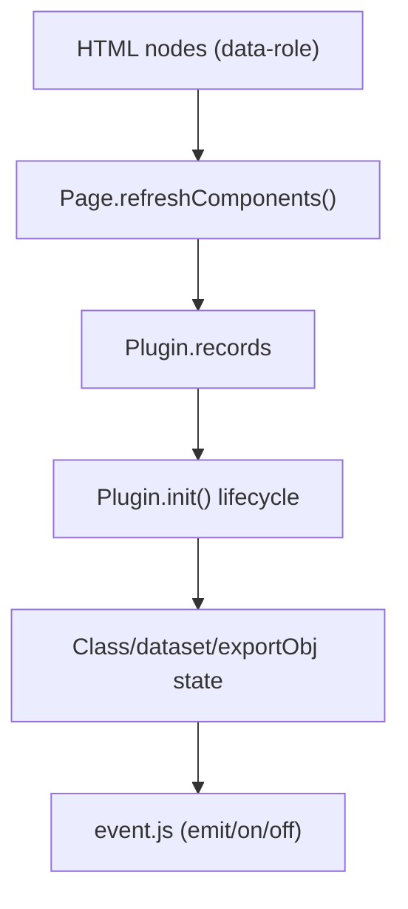

# Client Architecture

## Scope

This document describes the current client runtime in this repo. It is focused on code-verified behavior in:

- `client/js/core/*`
- `client/js/plugins/*`
- `client/scss/*`
- `client/pages/*`

## Design Model

The client follows a declarative plugin model:

1. HTML declares behavior with `data-role`.
2. `Page` scans the DOM and discovers role nodes.
3. `Plugin` registry resolves and initializes role handlers.
4. Plugin instance state is represented by classes, dataset, and instance exports.

This keeps markup expressive while avoiding per-page imperative bootstrap code.

## Runtime Flow

```mermaid
flowchart TD
  htmlNodes["HTML nodes (data-role)"] --> pageRefresh["Page.refreshComponents()"]
  pageRefresh --> pluginRegistry["Plugin.records"]
  pluginRegistry --> pluginInit["Plugin.init() lifecycle"]
  pluginInit --> pluginState["Class/dataset/exportObj state"]
  pluginState --> eventBus["event.js (emit/on/off)"]
```

## Core Modules

### `client/js/core/page.js`

- Owns page-level lifecycle and context (`ctx`).
- Emits page events such as initial DOM load and updates.
- Performs role-based component refresh and plugin re-initialization.

### `client/js/core/plugin.js`

- Registers plugin definitions (`name`, options, lifecycle hooks).
- Tracks plugin instances and maps each DOM node to its instance id.
- Provides init/render/load lifecycle sequencing.

### `client/js/core/event.js`

- Provides `on`, `once`, `off`, `emit`, `trigger`.
- Supports namespaced custom events (`event.namespace`) and selected native events.
- Used as cross-plugin communication channel and page lifecycle bus.

### `client/js/core/dom.hook.js`

- Hooks DOM write paths (like `innerHTML` updates) to prevent stale plugin references.
- Helps keep plugin lifecycle consistent when dynamic HTML is injected.

### `client/js/core/def.js`

- Shared utility helpers for plugin state APIs.
- `defBool` / `defEnum` patterns create standardized methods tied to class-state behavior.

## Plugin Authoring Pattern

Most plugins follow this shape:

- File: `client/js/plugins/_<name>.js`
- Export object with:
  - `name`
  - `defaultOpt`
  - lifecycle methods (`init`, `load`, `render`, `destroy` depending on plugin)
- Registration through `client/js/plugins/index.js`.

Common conventions:

- Use `data-target` and related attributes for wiring.
- Toggle CSS classes for state changes rather than inline styles where possible.
- Use core event helpers instead of ad-hoc global listeners.

## CSS and Theme System

### SCSS organization

- Entry: `client/scss/index.scss`
- Aggregation: `client/scss/base.scss` with `@forward` modules.
- Component-level partials: `_button.scss`, `_modal.scss`, `_header.scss`, etc.

### Theme model

- Core visual tokens are CSS custom properties.
- Base theme defaults live in SCSS.
- Runtime theme values can be injected server-side from theme comps (`data/comps/theme*.js` + `server/ejs/comp_theme.js`).
- Dark mode behavior is controlled with theme variable overrides.

## Page Entry Structure

Webpack page entries map to:

- `client/pages/<page>/index.js`
- `client/pages/<page>/index.html`

Actual page list is in `webpack.config.base.page.js`.

## Practical Guidelines

- Prefer extending `client/js/core/*` utilities over duplicating behavior in plugins.
- Keep plugin responsibilities narrow: one role, one purpose.
- Treat class names as state contracts between JS and SCSS.
- Clean up listeners/timers in plugin teardown paths.
- Keep docs in sync when plugin attributes or lifecycle behavior changes.

## Known Drift / Cleanup Targets

These are implementation observations and should be treated as follow-up work:

- Some plugins still contain legacy jQuery-style patterns.
- A few CSS utility names and forwards appear inconsistent.
- Theme token naming has minor typo risk in defaults.

Address these in code changes, then update this doc accordingly.
