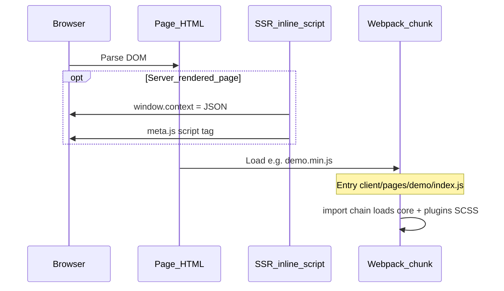
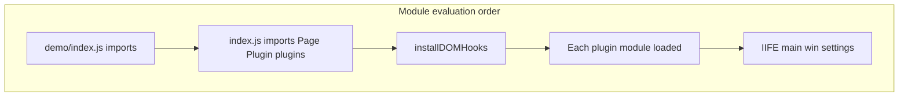
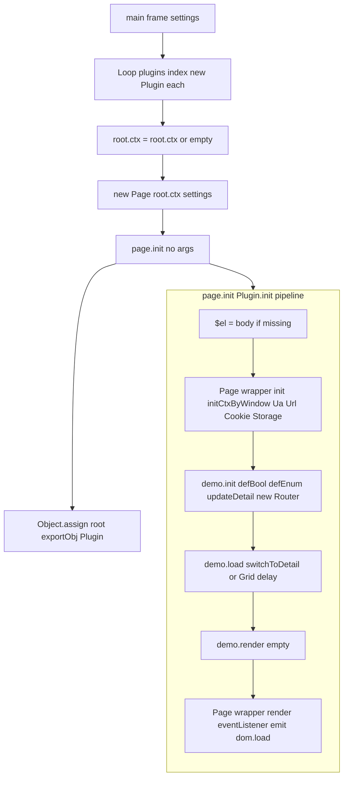
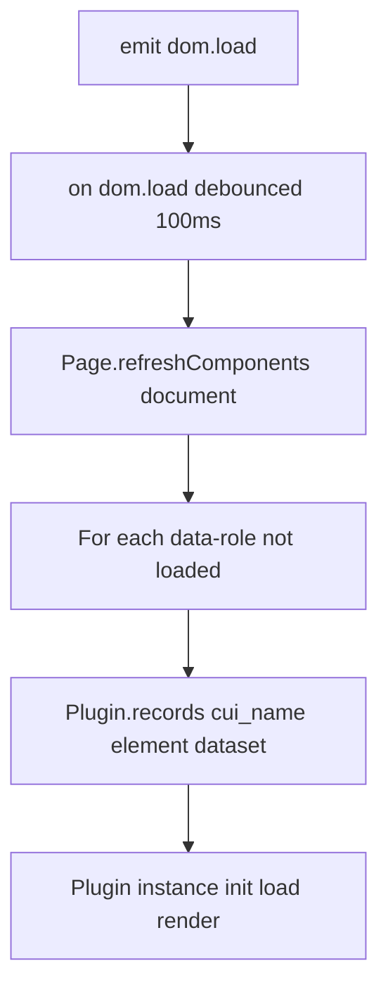
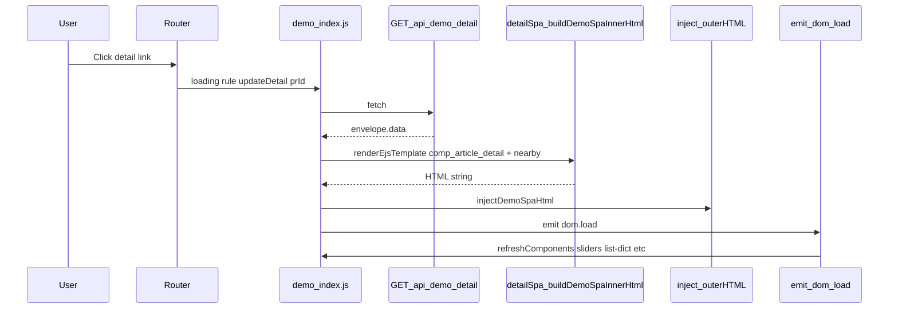
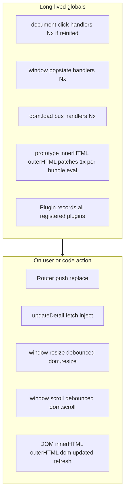
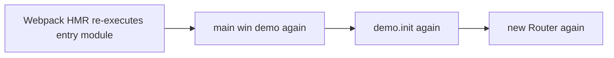

# Client-side JS lifetime (Pure)

Canonical reference for how webpack page bundles boot, run the Page/plugin pipeline, wire the demo Router, and refresh `[data-role]` components. Use this when debugging duplicate `init`, double fetches, or missing plugin binding after SPA HTML inject.

For the full `/demo/tx` path (build + Express SSR + APIs + client), see [`demo-tx-lifecycle.md`](demo-tx-lifecycle.md).

---

## 1. Document and bundle entry



| Stage | What runs | Where |
|--------|-----------|--------|
| Static HTML | Markup, optional `<!-- include:header.html -->` | `client/pages/<page>/index.html` |
| SSR extras | `window.context`, theme script | `server/ejs/html_below.ejs` |
| Webpack entry | Page IIFE: `window.page = main(win, settings)` | `client/pages/<name>/index.js` |
| Build config | One chunk per page name | `webpack.config.base.page.js` |

---

## 2. Module evaluation (once per script execution)

When the bundle entry module runs, imports execute **top-down** before `main()`:



**`installDOMHooks()`** ([`client/js/core/dom.hook.js`](../client/js/core/dom.hook.js), called from [`client/js/index.js`](../client/js/index.js)):

- Patches `innerHTML` / `outerHTML` / `textContent` / `innerText` setters on prototypes.
- On DOM writes: queue plugin cleanup + `emit('dom.updated')` → targeted `Page.refreshComponents(el)`.

Runs **once per bundle evaluation**, not inside `main()`.

---

## 3. `main()` bootstrap



| Step | File | Behavior |
|------|------|----------|
| Register plugins | `client/js/plugins/index.js` | `new Plugin(setting)` → `Plugin.register` → `Plugin.records['cui_<name>']` |
| Page instance | `client/js/core/page.js` | Merges page-specific settings (e.g. `demo`) into Plugin lifecycle |
| `page.init()` | `client/js/index.js` | Direct call on `Page` instance (not via `data-role` scan) |
| `exportObj` | Same | Exposed as `window.exportObj` after promise resolves |

**Important:** Widget plugins use `data-role` + `refreshComponents`. The **page/demo** plugin runs only via `main()` → `page.init()`, not by scanning the body for `data-role="demo"`.

---

## 4. Demo `init`: Router and global listeners

Inside `demo.init` ([`client/pages/demo/index.js`](../client/pages/demo/index.js)):

```mermaid
flowchart LR
	demoInit[demo.init]
	router[new Router rules linkScope demo]
	rInit[Router.init]
	click[document click listener]
	pop[window popstate listener]
	replace[replace current pathname]

	demoInit --> router --> rInit
	rInit --> click
	rInit --> pop
	rInit --> replace
```

| `Router.init` | Effect |
|---------------|--------|
| `click` | Intercepts same-origin `/demo/` links → `push()` → rule `loading` |
| `popstate` | Back/forward → `navigate` |
| `replace(pathname)` | Initial route sync (detail URL can trigger `updateDetail` on load) |

**Lifetime issue (fixed):** Each `new Router()` used to add another `document` click listener with no teardown. **Now:** `Router.destroy()` removes listeners; constructing a new `Router` destroys `Router.active`; `main()` is idempotent per frame (`__pureMainPage` boot guard). HMR can call `resetMain()` via `module.hot.dispose`.

If `main()` / `demo.init` still appears to double-fetch, check that the entry script is not evaluated twice without dispose, and that DevTools shows a single `document` click listener.

---

## 5. First `dom.load` and `[data-role]` plugins

After page `render`, `Page.eventListener()` ([`client/js/core/page.js`](../client/js/core/page.js)) runs once per completed `page.init`:



**Stacking:** Every full `page.init()` → `render` → `Page.eventListener()` adds **another** debounced `dom.load` handler on the custom event bus ([`client/js/core/event.js`](../client/js/core/event.js)), not `document.addEventListener('dom.load')`.

---

## 6. Demo SPA detail path



| Piece | Role |
|-------|------|
| `client/pages/demo/detailSpa.js` | Webpack-compiled EJS → HTML |
| `client/js/core/renderEjs.js` + `helpers/ejsRenderContext.js` | `getHref` / `getSrc` like SSR |
| `injectDemoSpaHtml` | Replaces `#detail` and `section.result` `outerHTML` |
| `emit('dom.load')` | Re-binds plugins on new markup |

`outerHTML` updates go through DOM hooks → `dom.updated` → partial `refreshComponents`. See also [`docs/listing-data-pipeline.md`](listing-data-pipeline.md).

---

## 7. Ongoing runtime (after boot)



---

## 8. When the graph runs again (duplicate lifetime)



Same in production if the entry script were evaluated twice (unusual).

**Symptoms (before fix):**

- `console.count('demo.init')` → 2+
- `updateDetail` / detail API called twice per click
- Multiple `document` click listeners (DevTools: `getEventListeners(document).click`)

**Not caused by:** `refreshComponents` alone (does not call `demo.init`). **Was caused by:** repeated `Router.init()` without teardown.

**Mitigation (implemented):** `Router.destroy()` + `Router.active` singleton teardown; `main()` boot guard (`__pureMainPage`); `resetMain()` for HMR dispose. See [`client/js/core/router.js`](../client/js/core/router.js) and [`client/js/index.js`](../client/js/index.js).

---

## 9. Quick reference: who owns what

| Concern | Owner | Init trigger |
|---------|--------|----------------|
| Page context (`exportObj.ctx`) | `Page` wrapper | `page.init()` |
| Demo view state (`switchToGrid`, etc.) | `defEnum` on `body` | `demo.init` |
| Client routing | `Router` | `demo.init` → `new Router` |
| Detail HTML + fetch | `exportObj.updateDetail` | Router `loading` or manual |
| Widget plugins (slider, header, …) | `Plugin.register` | `dom.load` / `dom.updated` → `refreshComponents` |
| SOA-shaped data | `window.context` / API envelope | SSR inline or `updateDetail` assign |

---

## Related docs

- [`client.md`](../client.md) — plugin model, SCSS, practical guidelines
- [`docs/listing-data-pipeline.md`](listing-data-pipeline.md) — demo data → EJS / SPA
- [`build-system.md`](../build-system.md) — webpack entries and output
