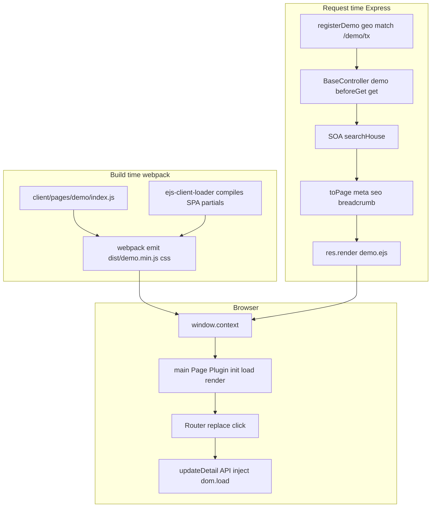

# Demo `/demo/tx` lifecycle

End-to-end map of **`GET /demo/tx`**: webpack build vs SSR EJS, Express request → HTML, SOA/APIs (shapes and errors), and client Plugin/Router phases.

Related docs:

- Listing data layers (SOA → metadata → comps): [`listing-data-pipeline.md`](listing-data-pipeline.md)
- Client boot / Router / `dom.load` (general): [`client-js-lifecycle.md`](client-js-lifecycle.md)
- Route patterns: [`routes-reference.md`](routes-reference.md)
- Webpack: [`../build-system.md`](../build-system.md)

**This project does not use** middleware or lifecycle names like `beforeRequest`, `afterRequest`, `beforeResponse`, `afterResponse`, `beforeCompile`, or `afterBuild` as hook APIs. Sections below use **real** names only.

---

## Overview



---

## 1. Build / compile timeline

| Phase | What actually happens | Key files |
|-------|----------------------|-----------|
| **Source** | Demo page entry, SCSS, SPA HTML builders | [`client/pages/demo/index.js`](../client/pages/demo/index.js), [`client/scss/demo.scss`](../client/scss/demo.scss), [`detailSpa.js`](../client/pages/demo/detailSpa.js) |
| **Webpack transform (“compile”)** | Babel/SCSS; **SPA** EJS partials → client `render()` via ejs-client-loader | [`webpack.config.base.js`](../webpack.config.base.js), [`webpack.config.base.page.js`](../webpack.config.base.page.js), [`helpers/ejs-client-loader.js`](../helpers/ejs-client-loader.js) |
| **Webpack emit (“build”)** | `dist/demo.min.js`, `demo.min.css`, shell `dist/demo.html` | `npm run build:prod` / `build:stage` / `dev` |
| **No separate CLI** | There is **no** `npm run compile` | — |
| **SSR EJS** | **Not** baked into live `/demo/tx` HTML at webpack time; rendered per request | Express views [`server/ejs/`](../server/ejs/) |
| **Dev HMR** | When `webpackHotReload` is on | [`webpack.config.dev.js`](../webpack.config.dev.js), [`server/config.js`](../server/config.js) |

Live URL `http://localhost:3000/demo/tx` is **Express SSR** (`demo.ejs`), not the webpack HtmlWebpackPlugin shell `dist/demo.html`.

| Informal name | Meaning here |
|---------------|--------------|
| Compile | Webpack loaders transforming source (incl. SPA EJS → functions) |
| Build | Webpack writing `dist/` assets |
| Dynamic inject | Browser SPA replacing `#detail` / nearby HTML after `GET /api/demo/detail/:prId` |

---

## 2. Server request → response (`GET /demo/tx`)

### Middleware and routing

Ordered path (no `beforeRequest` / `afterResponse` hooks):

1. [`server/app.js`](../server/app.js) — `compression` → session → Referrer-Policy → CORS → `express.static('dist')` (may serve a previously saved `dist/demo/tx.html`) → `app.use('/', router)`
2. [`server/routes/index.js`](../server/routes/index.js) — `registerDemo` among other registrars
3. [`server/routes/demo.js`](../server/routes/demo.js) — geo catch-all `createDemoSpaRegExp('geo')` matches `/demo/tx`
   - `tail` → `"/tx"`
   - `getCanonicalDemoGeoRedirectPath(tail)` → **`null`** for bare `tx` (no 301)
   - `req.query.geoPath = tail`
   - `handleDemoRoute(new BaseController(req, res, 'demo'), res)`

### Controller hooks that exist (demo config)

Contract: [`server/controllers/configbase.js`](../server/controllers/configbase.js). Demo implements:

| Hook | Role on `/demo/tx` |
|------|--------------------|
| `beforeGet` | `getGeoByPath(geoPath)` → `{ geo: { state: 'tx', type: 'state' }, prId }` |
| `get` | Parallel SOA; map articles; return page `data` |
| `seo` | Prefers `model.data.seo` from `get` |
| `preload` | Welcome image preload when `welcomeImage` set |

**Not on demo (and not inventable as Express phases):** `onError`, `beforePost`/`post`/`update`/`delete`, `beforeRequest`, `afterRequest`, `afterGet`, `afterPage`.

### `demo.get()` for `/demo/tx`

[`server/controllers/demo.js`](../server/controllers/demo.js):

```text
Promise.all([
  searchHouse(geo),                    // runs
  getPropertyListingInfoById(prId),    // skipped (no prId)
  getPropertyHistoryById(prId),        // skipped
])
→ detail = null
→ articles = mapSOADataListToArticles(nearbyRaw.listings) or []
→ return { seo, geo, articleComponent, articleTotalCount, headerComponent,
           footerComponent, welcomeImage, cdnHost, appHost, soaApiDomain, detail }
```

SOA helpers live in [`server/routes/api.soa.property.js`](../server/routes/api.soa.property.js). Failed SOA (`fetchFromSoa` → `null`) yields **empty articles**, still **HTTP 200** for HTML (no throw).

### `toPage` → HTML

[`BaseController.toPage`](../server/controllers/index.js):

1. `initialMeta` — `meta.css` / `meta.js` → `/demo.min.css`, `/demo.min.js`; merges `preload`
2. `initialSeo` / `initialBreadcrumb` / theme `inlineCss`
3. Attach `getHref`, `getSrc`
4. `res.render('demo.ejs', model)` → `res.send(html)`
5. Optional `saveStaticHtml` → `dist/demo/tx.html`

### EJS include order ([`demo.ejs`](../server/ejs/demo.ejs))

1. `html_above` — SEO, CSS/JS preload, theme
2. Header (`comp_header` via component or fallback)
3. `comp_breadcrumb`
4. `comp_article_detail` — **skipped** (`detail` is null)
5. `comp_demo_nearby` → each `comp_article` (omitted if no cards)
6. `html_menu`
7. Footer
8. `html_below` — `window.context = JSON.stringify(data)` + `<script src="<%= meta.js %>">`

### Status codes

| Case | Result |
|------|--------|
| Normal (incl. empty listings) | **200** HTML |
| `get()` throws → `code === 500` | **500** plain text: `Unable to load this page…` |
| EJS render error | **500** plain text |
| Non-canonical geo (e.g. `/demo/austin/tx`) | **301** to canonical path |
| `/demo` alone | **301** → `/demo/sitemap` |

---

## 3. APIs and data shapes

### Summary

| Endpoint | Used on cold `/demo/tx`? | Used after article click? | Envelope |
|----------|--------------------------|---------------------------|----------|
| `GET /demo/tx` (HTML) | Yes | No (SPA stays on client) | HTML + `window.context` |
| `GET /api/demo/detail/:prId` | No | Yes | `{ code, data, error, cost }` |
| `GET /api/demo/:geoPath(*)` | No | No (geo SPA only switches view) | Same BaseController envelope |
| `GET /api/demo/search/:path(*)` | No | No | Ad-hoc `{ articles, totalCount }` |
| SOA (server-only) | `searchHouse` | Detail API also hits listing + histories | Internal; not browser-visible |

### HTML / `window.context` (`model.data` for `/demo/tx`)

```js
{
  seo: { title, description, desc, keywords },
  geo: { state: 'tx', type: 'state' },
  articleComponent: { name: 'article', template: 'comp_article', data: Article[] },
  articleTotalCount: number,
  headerComponent: { name, template, data },
  footerComponent: { name, template, data },
  welcomeImage: string,   // absolute CDN URL
  cdnHost, appHost, soaApiDomain: string,
  detail: null
}
```

After `toPage`, the render model also has top-level `meta`, `seo`, `breadcrumb`, `getHref`, `getSrc`. Client hydration uses **`window.context`** (= `data` from `html_below`), not the full Express locals object.

### List card (`mapPropertyToArticle`) — abbreviated

```js
{
  metadata: /* mapSOADataToMetadata output */,
  img, imgTag, imgAlt,
  title,                    // display address
  path: '/demo/detail/{state}/{zip}/{prId}',
  tags: [{ text, className }],
  attrs: [{ key, value, desc, className }],
}
```

`getHref(article)` builds the `<a href>` from `appHost` + `path`.

### `GET /api/demo/detail/:prId`

- **Route:** [`server/routes/api.js`](../server/routes/api.js) — sets `req.query.prId` → `BaseController('demo').get()` → [`toData`](../server/controllers/index.js)
- **Success (typical):** HTTP status = `code` (200)

```js
{
  code: 200,
  data: {
    /* same fields as demo.get(), plus detail populated */,
    meta: { /* initialMeta: css, js, role, preload, … */ },
  },
  error: undefined,
  cost: /* ms since controller construct */,
}
```

- **Error from `get()` throw:** `{ code: 500, error: string, data: null }` via `exceptionDataHandler` (demo has **no** `onError`). Note: `toData` assigns `model.data.meta`; a true `data: null` error can throw before JSON is sent.
- **Client fail rule** ([`updateDetail`](../client/pages/demo/index.js)): treat as failure if `code !== 200` or truthy `error`.

With `prId`, server SOA calls **listing + histories + nearby** (geo from detail query when set by HTML detail route; API detail path sets `prId` only — see route handler).

### `GET /api/demo/search/:path(*)`

Not used by the demo SPA Router. Ad-hoc JSON (not `code`/`cost` envelope):

| Status | Body |
|--------|------|
| 200 | `{ articles, totalCount }` |
| 400 | `{ error: 'Invalid geo path' }` |
| 500 | `{ error: 'Internal server error' }` |

### `GET /api/demo/:geoPath(*)`

Same `demo.get()` + `toData` envelope as detail. Exists for JSON consumers; **demo client geo navigation does not call it** (only `switchToGrid`).

### Server-only SOA (not `/api/demo/*` from the browser)

| Function | SOA target (approx.) | On `/demo/tx` SSR |
|----------|----------------------|-------------------|
| `searchHouse(geo)` | `POST …/listings/nearbysearch/v2` | Yes |
| `getPropertyListingInfoById` | `GET …/properties/{id}/primary-listing` | No |
| `getPropertyHistoryById` | `GET …/properties/{id}/histories` | No |

Failures are swallowed to `null` → empty UI, still 200 HTML/JSON when `get()` does not throw.

---

## 4. Client lifecycle

### Plugin pipeline (real names)

[`Plugin.init`](../client/js/core/plugin.js) always runs:

```text
initBefore → setting.init → initAfter
→ loadBefore → setting.load → loadAfter
→ renderBefore → setting.render → renderAfter
```

Demo settings define only **`init`**, **`load`**, **`render`**. Before/After wrappers still run (logging / optional hooks). These are **methods**, not bus event names.

Bus events that **do** exist: `dom.load`, `dom.updated`, `dom.resize`, `dom.scroll`.  
**Not** events: `beforeLoad`, `page.ready`, `initBefore` (as `emit` names).

### Cold boot on `/demo/tx`

| Step | What runs | Where |
|------|-----------|--------|
| 1 | Parse SSR HTML | `demo.ejs` |
| 2 | `window.context = …` | `html_below.ejs` |
| 3 | Load `/demo.min.js` | `meta.js` |
| 4 | `installDOMHooks()` then `main(window, demo)` | [`client/js/index.js`](../client/js/index.js) |
| 5 | Register widget plugins; `new Page` → `page.init()` | Page extends Plugin |
| 6 | **init** — `defBool` / `defEnum`, `updateDetail`, `new Router({ linkScope: 'demo' })` → click/popstate + `replace(pathname)` | [`demo/index.js`](../client/pages/demo/index.js), [`router.js`](../client/js/core/router.js) |
| 7 | Register page instance on `body` + `loaded=2` | [`page.js`](../client/js/core/page.js) — prevents `dom.load` → `refreshComponents` from re-initing body/`data-role="demo"` (second Router) |
| 8 | **load** — `switchToGrid()` (no `context.detail`); resolve after **1000ms** | `demo.load` |
| 9 | **render** — `Page.eventListener()`; `emit('dom.load')` | Page wrapper; demo `render` is empty |
| 10 | Debounced `refreshComponents` → `[data-role]` widgets | `page.js` |

Router rules (order): **detail** → **map** → **geo**. On `/demo/tx`, `replace` matches **geo** → `loading` only calls `switchToGrid` (no fetch). Detail `loading` skips fetch only on initial `replace` (SSR detail hard load). Back/forward uses `goto` and must still `updateDetail` + `switchToDetail` because the browser already changed the URL. Contract: [`client-js-lifecycle.md` §4](client-js-lifecycle.md#4-client-router-contract).

### SPA click on article `<a>`

```text
document click → getInternalPath → shouldHandleDemoLink
→ preventDefault → Router.push
→ routerTo(detail) → navigate → rule.loading
→ updateDetail(prId)
→ fetch GET /api/demo/detail/:prId
→ buildDemoSpaInnerHtml → injectDemoSpaHtml (#detail + section.result)
→ Object.assign(window.context, …) → emit('dom.load')
→ switchToDetail (or switchToGrid on fail)
→ history.pushState
```

DOM writes go through hooks in [`dom.hook.js`](../client/js/core/dom.hook.js) → often `emit('dom.updated')` for targeted refresh, plus full `dom.load` refresh after inject.

Sitemap paths and modifier-clicks use **full navigation** (`shouldHandleDemoLink` false).

---

## 5. Two timelines side-by-side

### Cold load `GET /demo/tx`

| Time | Layer | Action |
|------|-------|--------|
| Ahead of request | Build | `demo.min.js` / `.css` already in `dist/` (or webpack-dev-server) |
| Request | Express | Geo route → `beforeGet` → `get` → SOA nearby → `toPage` → `demo.ejs` |
| Response | Browser | HTML + `window.context` |
| After script | Client | Plugin init → Router → load (grid + 1s) → render → `dom.load` widgets |

No browser call to `/api/demo/*` on first paint.

### Click listing title (detail SPA)

| Time | Layer | Action |
|------|-------|--------|
| Click | Router | Intercept `<a href="…/demo/detail/…">` |
| Request | Browser | **One** `GET /api/demo/detail/:prId` |
| Response | JSON | Envelope with `data.detail` + nearby, etc. |
| After | Client | Inject HTML → view-detail → `pushState` (no full document reload) |

---

## Quick “does not exist” checklist

| Name | In this stack? |
|------|----------------|
| `beforeRequest` / `afterRequest` | No |
| `beforeResponse` / `afterResponse` | No |
| `beforeCompile` / `afterBuild` as hooks | No (only webpack scripts / loaders) |
| `afterGet` / `onError` on demo | No |
| `page.ready` / `beforeLoad` bus events | No |
| Plugin `initBefore` / `loadBefore` / … | Yes as **methods** on Plugin, not `emit` events |
| `beforeGet` / `get` / `seo` / `preload` | Yes on demo route config |
| `dom.load` / `dom.updated` | Yes as custom bus events |
