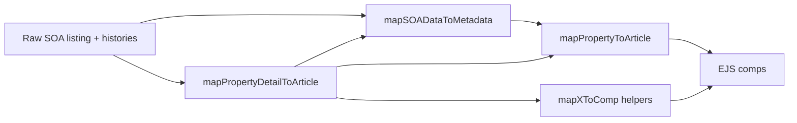

# Listing Data Pipeline (Demo Reference)

Canonical guide for how **SOA Property listings** flow through Pure: raw API → **metadata** → **comp UI models** → EJS (SSR) or JSON (SPA). Use the **demo page** as the reference implementation.

Normative coding rules: [`.cursor/rules/project-standards.mdc`](../.cursor/rules/project-standards.mdc). SOA HTTP reference: [`soa-api.md`](soa-api.md). Full `/demo/tx` build → SSR → client timeline: [`demo-tx-lifecycle.md`](demo-tx-lifecycle.md).

## Three layers (do not mix)

| Layer | Module | Entry function | Output |
|-------|--------|----------------|--------|
| **1. Metadata** | `helpers/property.js` | `mapSOADataToMetadata(soaListing, historiesRaw?)` | Normalized `metadata` object (source of truth after mapping) |
| **2. Comp UI models** | `helpers/article.js` | `mapPropertyToArticle(metadata)` (list), `mapPropertyDetailToArticle(listing, histories)` (detail) | Shapes for `comp_article`, `comp_article_detail` |
| **3. Templates** | `server/ejs/comp_*.ejs` | Includes from `demo.ejs`, `page.ejs`, etc. | HTML only; no SOA parsing |



### Controller rule

After calling `mapPropertyDetailToArticle(listingRaw, historiesRaw)` (or list mappers), controllers must use **`metadata`**, **`detail.*` comp fields**, and **`buildDetailSeo(detail)`** only — not raw `listingRaw` for SEO, EJS, or business logic.

Example: [`server/controllers/demo.js`](../server/controllers/demo.js).

---

## SOA integration

### Paths

| Path | Purpose | Key files |
|------|---------|-----------|
| **SSR HTML** | Full demo pages | `server/routes/demo.js` → `BaseController('demo')` → `server/controllers/demo.js` |
| **JSON API** | SPA detail fetch | `GET /api/demo/detail/:prId` in `server/routes/api.js` → same `demo.get()` → `toData()` |
| **HTTP proxy** | External/tools call SOA verbatim | `/api/soa/property/*` → `server/routes/api.soa.property.js` → `fetchFromSoa()` in `server/controllers/realestate.js` |

### Demo controller SOA calls

`demo.get()` runs in parallel:

- `searchHouse(geo)` — nearby listings (grid)
- `getPropertyListingInfoById(prId)` — primary listing (detail)
- `getPropertyHistoryById(prId)` — histories (detail)

Imported from `server/routes/api.soa.property.js` (not an internal HTTP hop to `/api/soa`).

### Auth

All SOA requests use header `X-MData-Key` from `SOA_API_KEY`. See [`soa-api.md`](soa-api.md).

---

## Layer 1: Metadata (`helpers/property.js`)

`mapSOADataToMetadata(soaListing, historiesRaw?)`:

- Returns `null` if listing has no `id`.
- Maps SOA Pure fields to stable names: `propertyId`, `geo`, `price`, `photos` (preview URL strings), `listingUrl`, `description` (`publicRemarks`), `groupedFeatures` (parsed object), `openHouses`, `area`, `areaUnit`, `areaDisplay`, `pricePerArea`, etc.
- When `historiesRaw` is provided: sets `metadata.histories` — sorted array of `{ date, title, subtitle }` (not raw SOA envelope).

Helpers that produce **comp-ready history/open-house shapes** (used by article layer):

- `mapHistoryRowsToTimelineComp(rows)` — `comp_timeline` model
- `mapOpenHousesToComp(openHouses)` — `comp_open_houses` model
- `normalizeGroupedFeatures()` — parses JSON string or object

**Do not** add tag/attr presentation or HTML here.

---

## Layer 2: Comp UI models (`helpers/article.js`)

### List cards (`comp_article`)

```js
mapSOADataListToArticles(soaListings)
  → mapSOADataToMetadata(each)
  → mapPropertyToArticle(metadata)
```

Article shape: `title`, `path`, `tags`, `attrs`, `img`, `metadata` (embedded).

### Detail page (`comp_article_detail`)

```js
mapPropertyDetailToArticle(soaListing, historiesRaw)
  → metadata = mapSOADataToMetadata(...)
  → card = mapPropertyToArticle(metadata, true)  // full attrs + groupedFeatures
  → comp fields via mapXToComp
```

Detail return shape (render models only):

| Field | Comp template | Mapper |
|-------|---------------|--------|
| `metadata` | (SEO, debugging, future use) | `mapSOADataToMetadata` |
| `title` | Page `<h1>` | from `mapPropertyToArticle` |
| `tags` | `comp_tags` | `mapTagsToComp(card.tags)` |
| `album` | `comp_album` | `mapAlbumToComp(metadata.photos, title)` |
| `paragraph` | `comp_paragraph` | `mapParagraphToComp(metadata.description)` |
| `record` | `comp_record` | `mapRecordToComp(card.attrs)` |
| `openHouses` | `comp_open_houses` | `mapOpenHousesToComp(metadata.openHouses)` |
| `timeline` | `comp_timeline` | `mapHistoryRowsToTimelineComp(metadata.histories)` |

`buildDetailSeo(detail)` reads `detail.metadata.listingStatus` and `detail.paragraph.text` — no raw listing.

### `mapPropertyToAttrs(property, allAttrs)`

Builds fact rows (`Est`, `Bd`, `Ba`, sqft, price/sqft, year). When `allAttrs === true`, adds agent/office/phone and merges **groupedFeatures** via `mapGroupedFeaturesToAttrs()` (one attr per non-empty group; empty arrays skipped).

---

## Layer 3: EJS (`server/ejs/`)

[`comp_article_detail.ejs`](../server/ejs/comp_article_detail.ejs) pattern:

```ejs
<%_ if (detail.album) { _%>
  <%- include('comp_album', { album: detail.album, getSrc }) %>
<%_ } _%>
```

Guard each include; pass `getSrc` / `getHref` from `BaseController.toPage()` model.

List grid: [`demo.ejs`](../server/ejs/demo.ejs) loops `articleComponent.data` and includes `comp_article`.

---

## BaseController: `toPage` vs `toData`

| | `toPage` | `toData` |
|---|----------|----------|
| **Output** | HTML (`${config.name}.ejs`) | JSON `{ code, data, error, cost }` |
| **SEO / breadcrumb** | yes | no |
| **Theme inline CSS** | yes | no |
| **`getHref` / `getSrc`** | on model | no |
| **Static HTML cache** | optional write | no |
| **Typical routes** | `demo.js`, `page.js`, `default.js` | `/api/demo/detail/:prId`, `/api/geo`, etc. |

Both call the same `config.get()` — demo SSR and SPA share one data builder.

Contract: [`server/controllers/configbase.js`](../server/controllers/configbase.js).

---

## Client: plugins and demo SPA

### Plugins

1. `client/js/index.js` registers plugins from `client/js/plugins/index.js`.
2. `Page` (`client/js/core/page.js`) on `dom.load` scans `[data-role]`, initializes `Plugin` lifecycle (`init` → `load` → `render`).
3. After SPA injects HTML, `emit('dom.load')` re-binds plugins (e.g. `slider` on `#detail`).

EJS must emit matching `data-role` and `data-*` options. Example: `comp_album.ejs` → `data-role="slider"` → `client/js/plugins/_slider.js`.

### Demo client router

- `client/pages/demo/index.js` — `Router` rules for grid / detail / map; `linkScope: 'demo'`.
- Detail navigation: `fetch('/api/demo/detail/:prId')` → `buildDemoSpaInnerHtml(envelope.data)` in [`client/pages/demo/detailSpa.js`](../client/pages/demo/detailSpa.js) (renders [`comp_article_detail.ejs`](../server/ejs/comp_article_detail.ejs) + [`comp_demo_nearby.ejs`](../server/ejs/comp_demo_nearby.ejs) via [`client/js/core/renderEjs.js`](../client/js/core/renderEjs.js)) → `outerHTML` on `#detail` and nearby `section.result`.

**Data and markup** match SSR (`demo.get()` + same EJS comps). Render context (`getHref`, `getSrc`) comes from [`helpers/ejsRenderContext.js`](../helpers/ejsRenderContext.js).

---

## Adding a new detail section

1. **SOA field** → add to `mapSOADataToMetadata` in `helpers/property.js` (if new normalized field).
2. **Comp model** → add `mapXToComp()` in `helpers/article.js`; call from `mapPropertyDetailToArticle`.
3. **Template** → create `server/ejs/comp_x.ejs`; include from `comp_article_detail.ejs` with `<%_ if (detail.x) { _%>`.
4. **Plugin** (if interactive) → `client/js/plugins/_x.js`, register in `plugins/index.js`, `data-role="x"` in EJS.
5. **SPA** — add include in `comp_article_detail.ejs`; demo SPA picks it up automatically via client EJS bundle (no hand-built HTML).
6. **Tests** → extend `helpers/__tests__/property.test.js`.

See also [create-comp skill](../.cursor/skills/create-comp/SKILL.md) Pattern C (demo detail).

---

## What belongs in `helpers/`

| In `helpers/` | Elsewhere |
|---------------|-----------|
| SOA/geo/listing transforms (`property`, `article`, `geo`, `path`, `url`, `fuse`, `datetime`) | Raw seed data → `data/` |
| Pure comp-shape mappers tied to SOA (`mapHistoryRowsToTimelineComp`, `mapOpenHousesToComp`) | DOM/runtime → `client/js/core/` |
| | Controllers → `server/controllers/` |
| | EJS → `server/ejs/` |

---

## Testing

Primary mapping tests: `helpers/__tests__/property.test.js` (`mapSOADataToMetadata`, `mapPropertyDetailToArticle`, comp mappers).

Run full suite:

```bash
npm test
```

Controller contract: `server/controllers/__tests__/basecontroller.config.test.js`.

No Playwright/e2e in repo; optional Lighthouse via `npm run test:lighthouse`.

---

## Appendix: client EJS and future work

### Demo detail client EJS

- Webpack [`helpers/ejs-client-loader.js`](../helpers/ejs-client-loader.js) compiles `server/ejs/*.ejs` entries with static `include('…')` partials (function sources embedded as strings, instantiated via `new Function` for browser `include` support).
- [`renderEjsTemplate`](../client/js/core/renderEjs.js) merges [`createEjsRenderContext`](../helpers/ejsRenderContext.js) (same `getHref` / `getSrc` as `BaseController.toPage`).
- Dynamic `include(variable.template)` (e.g. `page.ejs`) is not bundled yet — needs a partial registry follow-up.

### Route patterns

- Server: regexes in `server/routes/demo.js`.
- Client: regexes in `client/pages/demo/index.js`.
- **Direction:** shared route manifest (e.g. `data/routes/demo.json`) consumed by both sides.

### Optional shared route manifest (RFC sketch)

```json
{
  "detail": {
    "pattern": "^/demo/detail/([a-z]{2})/([0-9a-z-]+)/([0-9a-z-]+)/?$",
    "params": ["state", "zip", "prId"],
    "query": { "geoPath": "{state}/{zip}", "prId": 2 }
  }
}
```

Single file imported by server route registration and client `Router` config generation (build-time or shared module).
