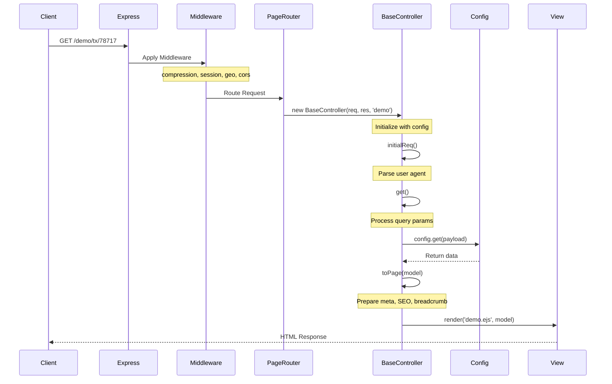
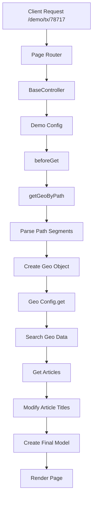

# Server Documentation

## System Description

The server is a Node.js application built with Express that handles geographical-based content delivery. It's designed to serve dynamic content based on location paths (state, city, zip, etc.) and provides a flexible framework for handling different types of requests while maintaining consistent response formatting.

### Key Components

- **Express Server**: Main application server
- **Middleware Stack**: Compression, session, geo, and CORS handling
- **Router System**: Page and API routing
- **Controller Framework**: Base controller with extensible configuration
- **View Engine**: EJS templating
- **Data Sources**: Geo data, mock articles, and dynamic content generation

## System Workflow

### Request Flow



### Data Flow



## System Model Design

### Page Data Model

The system uses a hierarchical model structure that's built up through several stages:

1. **Base Model Structure**
```javascript
{
  geo: {
    state: String,
    city: String,
    zipcode: String,
    type: String,
    // ... other geo properties
  },
  articles: Array<Article>,
  meta: {
    uaData: Object,
    lang: String,
    path: String,
    preload: Array<Resource>,
    css: String,
    js: String
  },
  seo: {
    title: String,
    desc: String,
    keywords: String
  },
  breadcrumb: {
    links: Array<{
      text: String,
      href: String
    }>
  }
}
```

2. **Configuration System**
```javascript
{
  name: String,
  beforeGet: Function,
  get: Function,
  preload: Function,
  seo: Function
}
```

3. **Geo Types**
```javascript
{
  state: 'state',
  city: 'city',
  county: 'county',
  zipcode: 'zipcode',
  address: 'address',
  neighborhood: 'neighborhood'
}
```

### Data Sources

1. **Geo Data**
   - Path-based parsing
   - Global search index
   - IP-based location detection

2. **Content Data**
   - Mock articles
   - Dynamic content modification
   - SEO metadata

3. **Navigation Data**
   - Breadcrumb generation
   - Path construction
   - URL formatting

## System Summary

### Key Features

1. **Flexible Routing**
   - Geographical path handling
   - Dynamic route matching
   - Path parameter extraction

2. **Data Processing**
   - Location-based content
   - Dynamic SEO generation
   - Breadcrumb navigation

3. **Performance Optimization**
   - Response compression
   - Resource preloading
   - Static file serving

4. **Security**
   - CORS configuration
   - Referrer policy
   - Session management

### Future Updates

To update this documentation when making changes to the server:

1. **Code Changes**
   - Update relevant sections in this document
   - Add new diagrams if workflow changes
   - Document new features or modifications

2. **Model Updates**
   - Update model structure documentation
   - Add new data source information
   - Document new configuration options

3. **Workflow Changes**
   - Update sequence diagrams
   - Modify data flow charts
   - Document new middleware or processing steps

### Maintenance Notes

- Keep diagrams up to date with code changes
- Document any new configuration options
- Update model structures when modified
- Maintain clear separation of concerns in documentation
- Include examples for new features 