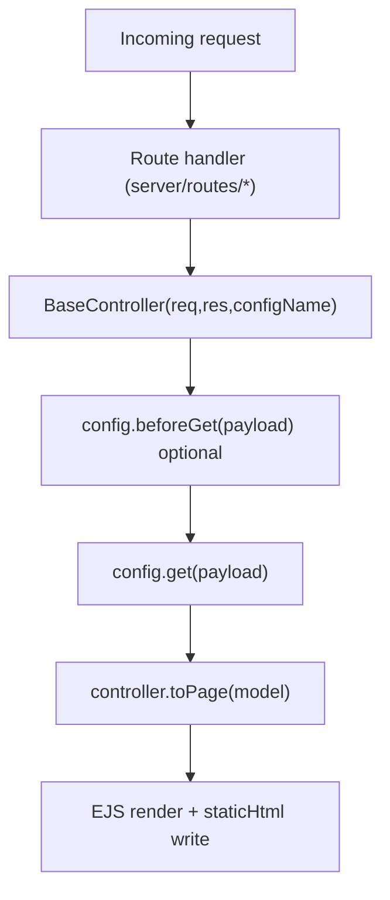

# Server Architecture

## Scope

This document describes the current server runtime implemented under `server/`.

Key areas:

- Express bootstrap and middleware
- Route topology
- Controller/config contract
- API and SOA proxy behavior
- CMS/local data fallback

## Runtime Entry

Main entry is `server/app.js`.

At startup it wires:

- Compression middleware
- Session middleware
- Geo middleware
- CORS and headers
- EJS view engine
- API docs (`/api-docs`)
- Main router (`server/routes/index.js`)

## Route Topology

Router composition in `server/routes/index.js`:

- Page and HTML routes via:
  - `default.js`
  - `demo.js`
  - `sitemap.js`
  - `page.js`
- API routes:
  - `/api` -> `server/routes/api.js`
  - `/api/soa` -> `server/routes/api.soa.js`

SOA prefixes currently mounted in `server/routes/api.soa.js`:

- `/api/soa/property/*`
- `/api/soa/school/*`
- `/api/soa/poi/*`
- geoarea and catch-all paths through `/api/soa/*`

## Request Lifecycle (Page Rendering)


```mermaid
flowchart TD
  request["Incoming request"] --> routeMatch["Route handler (server/routes/*)"]
  routeMatch --> baseController["BaseController(req,res,configName)"]
  baseController --> beforeGet["config.beforeGet(payload) optional"]
  beforeGet --> getData["config.get(payload)"]
  getData --> toPage["controller.toPage(model)"]
  toPage --> render["EJS render + staticHtml write"]
```

## Controller and Config Contract

`server/controllers/index.js` (`BaseController`) orchestrates config-driven behavior and registers route configs.

Other modules in `server/controllers/*` (route configs, e.g. `demo.js`, `page.js`) commonly define:

- `name`
- `beforeGet(payload)` (optional)
- `get(payload)` (required)
- `seo(payload)` (optional)
- `preload(payload)` (optional)

`server/controllers/configbase.js` contains the contract reference used by this architecture.

### `toPage` vs `toData`

| | `toPage` | `toData` |
|---|----------|----------|
| Output | HTML (`${config.name}.ejs`) | JSON `{ code, data, error, cost }` |
| SEO / breadcrumb / theme | yes | no |
| `getHref` / `getSrc` on model | yes | no |

Both call the same `config.get()`. Example: demo SSR and `GET /api/demo/detail/:prId` share [`server/controllers/demo.js`](server/controllers/demo.js).

Listing SOA → metadata → comp models: [`docs/listing-data-pipeline.md`](docs/listing-data-pipeline.md).

## API and Proxy Pattern

### App API (`/api`)

`server/routes/api.js` serves app-facing endpoints and model mapping helpers.

### SOA API (`/api/soa`)

- Route adapters are split by domain (`property`, `school`, `poi`, `geoarea`).
- Upstream calls are centralized through fetch helpers in `server/controllers/realestate.js`.
- Some geo responses are normalized through mapper utilities before returning.

## Data Source Strategy

Server-side content can come from:

- CMS API (when healthy/available)
- Local `data/` modules (fallback path)

The fallback orchestration is implemented in `server/utils/cmsData.js`.

## Dev and Environment Behavior

Environment resolution is controlled in `server/config.js`:

- development -> `.env` then `.env.local`
- stage -> `.env.stage`
- production -> `.env.production`

Defaults:

- `PORT=3000`
- webpack dev server port `3001`

## Testing Status (Server Focus)

Included in `npm run test`:

- `server/controllers/__tests__/basecontroller.config.test.js` — BaseController / `toPage` contract
- `server/controllers/__tests__/demo.get.test.js` — demo `get()` return shape (no SOA when no `prId`)
- `server/routes/__tests__/demoGeoRedirect.test.js` — demo geo canonical redirect
- `helpers/__tests__/property.test.js` — SOA metadata and detail comp mappers
- `helpers/__tests__/datetime.test.js`
- `helpers/__tests__/htmlPath.test.js`
- Root scripts: `test-geo-mapping.js`, `test-auto-detection.js`, `test-dialog-plugin.js`

Run subset:

```bash
npm run test:basecontroller
```

Full suite:

```bash
npm run test
```

No Playwright/e2e in repo; optional UI checks via `npm run test:lighthouse` (Docker + Lighthouse).

## Known Risks to Track

- SOA fetch helper error handling should consistently map upstream failures to explicit HTTP errors.
- Session secret should be supplied via env in all environments.
- A few older abstractions appear underused and may be candidates for cleanup.

Treat this section as an architecture watchlist, not a replacement for issue tracking.
